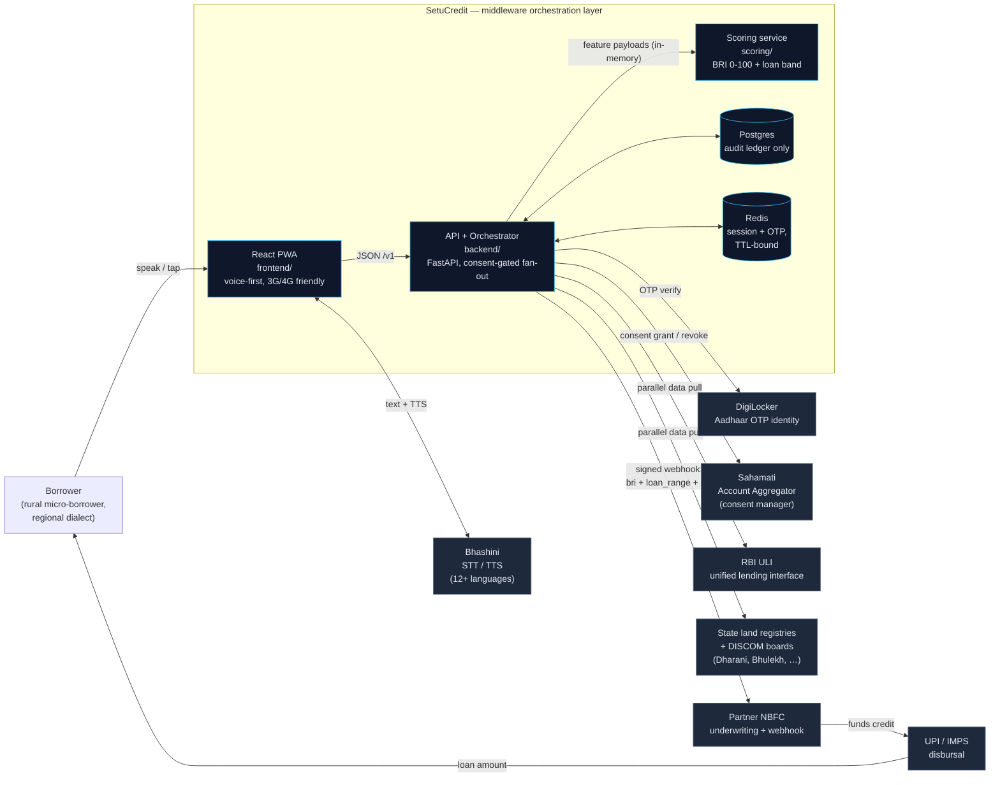
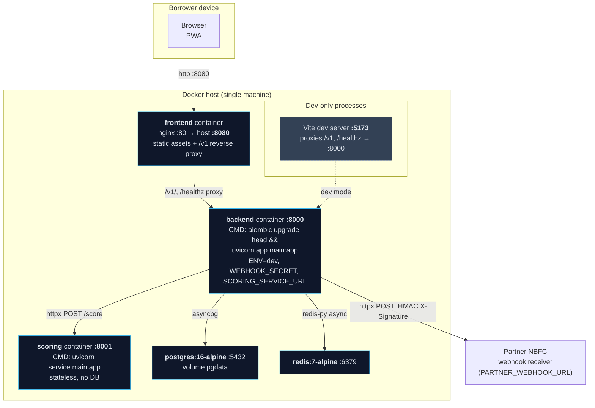
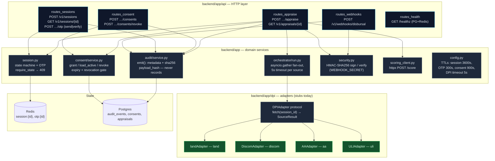
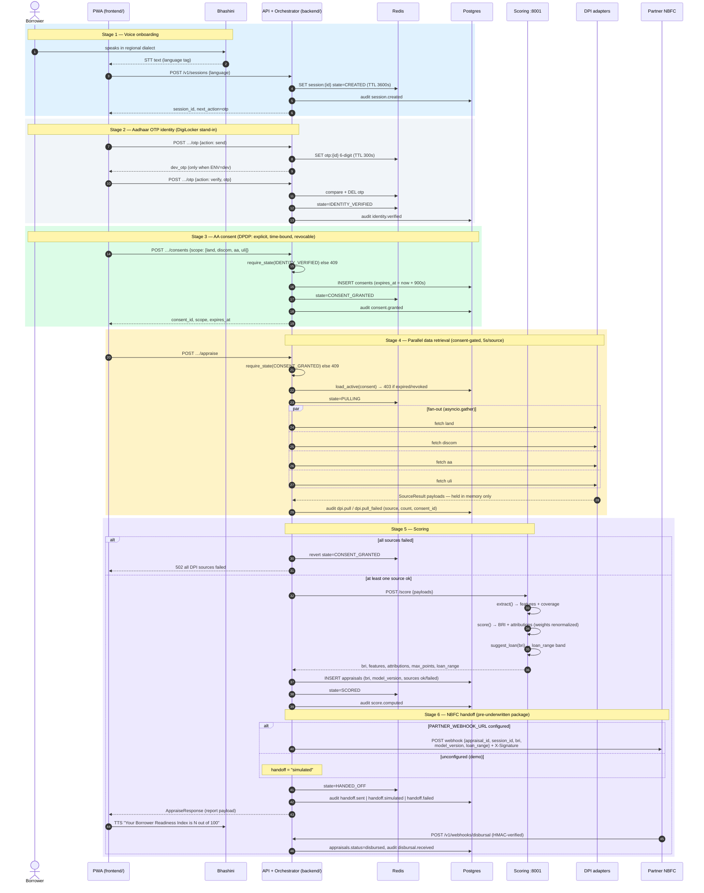
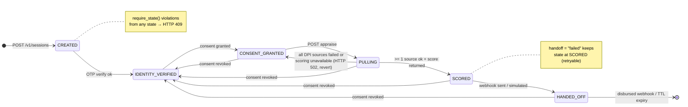
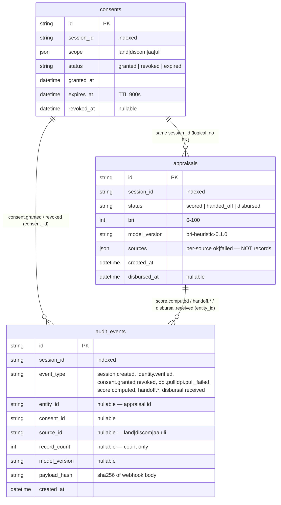
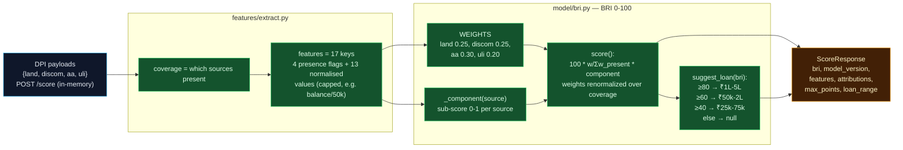
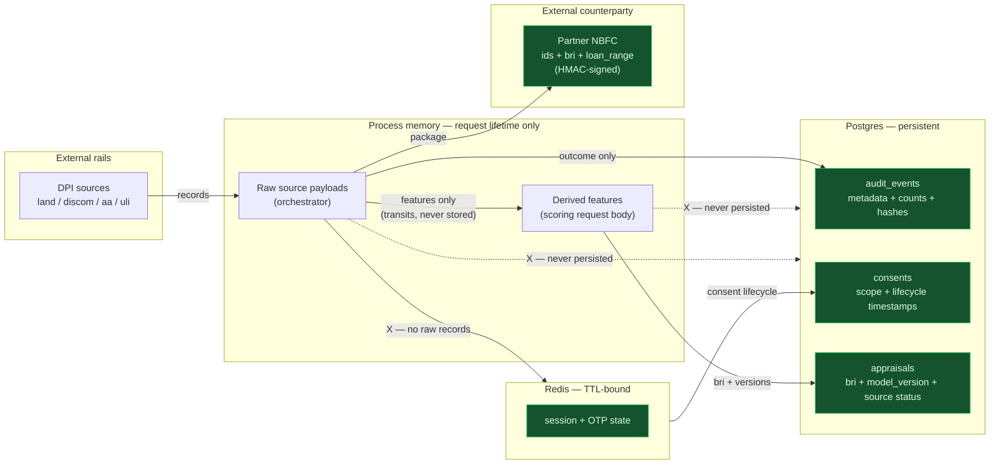
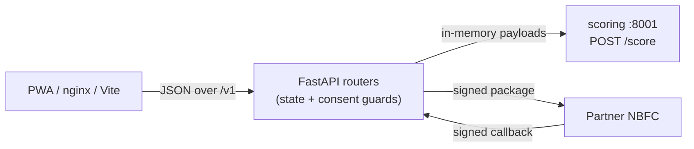

# SetuCredit — Architecture Diagrams

Visual companion to `docs/ARCHITECTURE.md` (which follows the HLD v1.0). All diagrams are
Mermaid — they render on GitHub and in any Mermaid-capable editor. Diagrams reflect the
**implemented** code (paths shown per diagram).

Printable version: [ARCHITECTURE_DIAGRAMS.pdf](ARCHITECTURE_DIAGRAMS.pdf) (18 pages,
A4 landscape, generated from this file).

Contents:

1. [System context (C4 level 1)](#1-system-context-c4-level-1)
2. [Deployment topology](#2-deployment-topology)
3. [Backend component map](#3-backend-component-map)
4. [End-to-end appraisal sequence (6 stages)](#4-end-to-end-appraisal-sequence-6-stages)
5. [Session state machine](#5-session-state-machine)
6. [Data model and retention](#6-data-model-and-retention)
7. [Scoring pipeline](#7-scoring-pipeline)
8. [Pass-through trust boundary](#8-pass-through-trust-boundary)
9. [API surface](#9-api-surface)

---

## 1. System context (C4 level 1)

SetuCredit is a middleware orchestration layer: it holds no borrower data and makes no
lending decision. It assembles a consented, pre-underwritten package from DPI rails, scores
it (BRI 0-100), and hands it to a partner NBFC.

**Two invariants (HLD §5)** govern every arrow above: borrower non-financial data is never
persisted (§8), and no DPI pull happens without a valid, unexpired, unrevoked consent
(enforced in `backend/app/consent/service.py` → HTTP 403).

## 2. Deployment topology

Single-host Docker Compose (`infra/docker-compose.yml`), profile `app`:

- Only `frontend :8080` and `backend :8000`/`scoring :8001` are reached from outside in a
  demo; Postgres/Redis/scoring are on the compose network.
- Scale-out path (post-hackathon): orchestrator and scoring are already separate processes;
  backend can be replicated behind a load balancer (sessions live in Redis, not in process).
- Non-functional (HLD): PWA stays light for 3G/4G; the fan-out is latency-sensitive hence
  parallel; voice degrades to text in the same language.

## 3. Backend component map

Key control points:

- **`require_state`** (session.py:67) — every route declares its legal source states;
  violations raise `StateError` → HTTP 409 (`main.py` handler).
- **Consent gate** (routes_appraise.py:31-34) — `load_active()` re-checks scope, expiry and
  revocation from Postgres right before the pull; failure → 403 and the session reverts to
  `CONSENT_GRANTED`.
- **Adapter isolation** (orchestrator/run.py:15-28) — a timeout or exception in one adapter
  becomes `SourceResult(ok=False)`; one bad rail never fails the appraisal.
- **Adapters are the only entry point for raw borrower records** — nothing downstream of
  `orchestrator` sees raw payloads except `scoring` (as features, in memory).

## 4. End-to-end appraisal sequence (6 stages)

HLD §3 stage numbering: 1 voice → 2 identity → 3 consent → 4 parallel pull → 5 scoring →
6 handoff/disbursal.

Notes:

- Scoring unavailable → `502`, session also reverts to `CONSENT_GRANTED` (routes_appraise.py:54-59).
- A failed *outbound* handoff leaves the session in `SCORED` (only `!= "failed"` advances to
  `HANDED_OFF`), so it can be retried; the response still returns `handoff="failed"`.
- No audio is ever stored: STT/TTS happen in the PWA; the API sees text only.

## 5. Session state machine

Lives in Redis (`backend/app/session.py`), TTL-bound, wiped on expiry. Illegal transitions
→ HTTP 409. Consent revocation is accepted from any post-consent state (DPDP).

`next_action` hints returned to the PWA (`schemas.NEXT_ACTION`):
`CREATED→otp`, `IDENTITY_VERIFIED→consent`, `CONSENT_GRANTED→appraise`,
`PULLING→wait`, `SCORED→wait`, `HANDED_OFF→done`.

## 6. Data model and retention

### Postgres — audit ledger only (`backend/migrations/versions/508ab15e2977_…`)

### Redis — ephemeral session state (`backend/app/session.py`)

| Key | Value | TTL |
|---|---|---|
| `session:{session_id}` | JSON: state, language, consent_id, appraisal_id | 3600 s |
| `otp:{session_id}` | 6-digit code (single use) | 300 s |

**Never stored anywhere** (pass-through by design): land records, utility bills, bank
transactions, AA/ULI payloads, derived feature values, audio. `loan_range` is computed
in-request and returned to the PWA / sent to the NBFC, but is not written to the ledger.

## 7. Scoring pipeline

Separate, stateless process (`scoring/`): in-memory payloads over HTTP in, BRI out.

Per-source sub-scores (`_component`, bri.py:35-62), all clamped to [0, 1]:

| Source | Formula |
|---|---|
| land | 0.50·(acres/5) + 0.30·clear_title + 0.20·(years/20) |
| discom | 0.60·on_time_ratio + 0.20·(months_paid/24) + 0.20·bill_level |
| aa | 0.40·balance_level + 0.40·inflow_consistency + 0.20·(months/60) − 0.30·emi_ratio |
| uli | 0.50·(1 − loans/4) + 0.30·(repay_months/24) + 0.20·(1 − delinquencies/3) |

- Sparse consents still score: absent sources drop out and the remaining weights
  renormalize (`Σ max_points = 100`).
- `score()` and `suggest_loan()` are pure functions — the HLD's trained XGBoost model drops
  in behind the same interface; `model_version` records which ran.
- BRI bands for the report: **≥80 Strong**, **≥60 Good**, **≥40 Fair**, **<40 Building**
  (loan range absent below 40).

## 8. Pass-through trust boundary

What may cross each boundary, and what may not — the invariant from HLD §5 rendered as a
data-flow diagram:

Compliance posture: purpose limitation (credit appraisal only), retention = audit ledger +
consent records only, revocable consent aborts any in-flight pull (DPDP); TLS 1.3 in
transit, AES-256 for stored audit logs (HLD §5); webhooks to/from the NBFC are
HMAC-SHA256-signed (`security.py`) with the appraisal body hashed into the ledger
(`payload_hash`).

## 9. API surface

| Method & path | Handler | Prerequisite state | On violation |
|---|---|---|---|
| `POST /v1/sessions` | routes_sessions | — | — |
| `GET  /v1/sessions/{id}` | routes_sessions | session exists | 404 |
| `POST /v1/sessions/{id}/otp` | routes_sessions | `CREATED` | 409 / 400 (bad OTP) |
| `POST /v1/sessions/{id}/consents` | routes_consent | `IDENTITY_VERIFIED` | 409 / 422 (bad scope) |
| `POST /v1/sessions/{id}/consents/revoke` | routes_consent | any post-consent state | 409 / 404 |
| `POST /v1/sessions/{id}/appraise` | routes_appraise | `CONSENT_GRANTED` + live consent | 409 / 403 / 502 |
| `GET  /v1/appraisals/{id}` | routes_appraise | appraisal exists | 404 |
| `POST /v1/webhooks/disbursal` | routes_webhooks | valid `X-Signature` | 401 / 400 / 404 / 422 |
| `GET  /healthz` | routes_health | PG + Redis ping | 503 if degraded |
| `POST /score` (internal :8001) | scoring/service | — | — |
| `GET  /healthz` (internal :8001) | scoring/service | — | — |

---

*Source of truth: `docs/SetuCredit_HLD_Document.pdf` → `docs/ARCHITECTURE.md` → this file →
code. Keep all four in sync; where they conflict, the HLD wins.*
